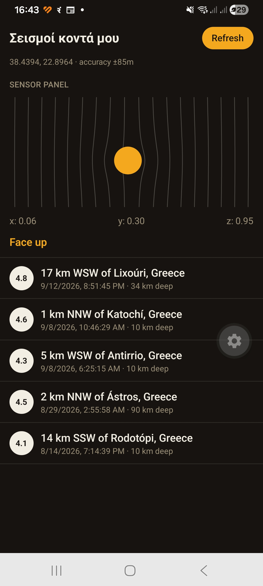
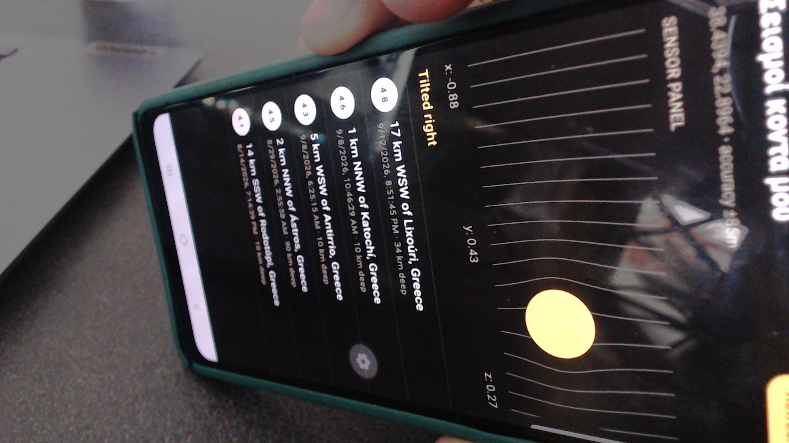
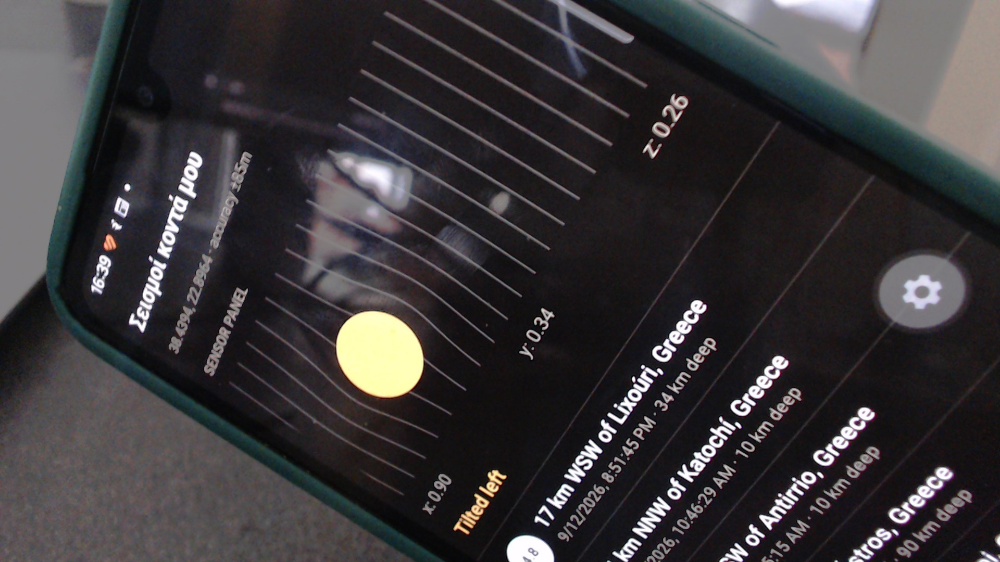

# Τεχνική Αναφορά - «Σεισμοί κοντά μου»

## Μέρος Α

### Ροή δεδομένων: από την τοποθεσία στην εμφάνιση

1. Κατά την εκκίνηση, το hook `useLocation` καλεί το
   `Location.requestForegroundPermissionsAsync()` (από το `expo-location`),
   ζητώντας άδεια πρόσβασης στην τοποθεσία στο προσκήνιο (foreground).
2. Αν η άδεια δοθεί, καλείται το `Location.getCurrentPositionAsync()` με
   `accuracy: Location.Accuracy.Balanced`, και το app αποθηκεύει σε state το
   γεωγραφικό πλάτος (`latitude`), μήκος (`longitude`) και την τιμή
   `accuracy` (η οποία εμφανίζεται άμεσα στην οθόνη, κάτω από τον τίτλο).
3. Μόλις υπάρχουν συντεταγμένες, το hook `useEarthquakes` καλεί το USGS
   Earthquake API:

   ```
   https://earthquake.usgs.gov/fdsnws/event/1/query
     ?format=geojson&latitude={lat}&longitude={lon}
     &maxradiuskm=300&limit=20&orderby=time
   ```

4. Η απάντηση (GeoJSON `FeatureCollection`) μετατρέπεται σε μια λίστα
   αντικειμένων `Earthquake` (μέγεθος, περιοχή, χρόνος, βάθος, συντεταγμένες,
   URL) και αποθηκεύεται σε state.
5. Η λίστα εμφανίζεται με `FlatList`, όπου κάθε γραμμή (`EarthquakeListItem`)
   δείχνει μέγεθος (σε έγχρωμο badge), περιοχή και μορφοποιημένο χρόνο
   καταγραφής.

### Άδειες που ζητήθηκαν

- **Τοποθεσία (foreground):** μέσω `expo-location`, απαιτείται τόσο σε
  Android (`ACCESS_COARSE_LOCATION` / `ACCESS_FINE_LOCATION`, ρυθμισμένα
  αυτόματα από το config plugin του `expo-location` στο `app.json`) όσο και
  σε iOS (`NSLocationWhenInUseUsageDescription`).
- **Επιταχυνσιόμετρο (Accelerometer):** **δεν** ζητήθηκε καμία άδεια, καθώς
  το `expo-sensors` δεν απαιτεί κάτι τέτοιο για το raw accelerometer σε
  iOS/Android.
  Πηγή: [expo-sensors docs](https://docs.expo.dev/versions/latest/sdk/sensors/).

### Χειρισμός φόρτωσης, αποτυχιών και έλλειψης δεδομένων

- **Φόρτωση:** όσο εκκρεμεί το αίτημα τοποθεσίας ή σεισμών, η `FlatList`
  εμφανίζει το native `refreshing` indicator (μέσω του συνδυασμένου
  `loading` state των δύο hooks). Το `ListEmptyComponent` εμφανίζεται μόνο
  όταν `!loading`, ώστε να μην εμφανιστεί ψευδώς «δεν βρέθηκαν αποτελέσματα»
  ενώ εκκρεμεί ακόμα το αίτημα.
- **Αποτυχίες:** κάθε αποτυχία (άρνηση άδειας τοποθεσίας, αποτυχία λήψης
  τοποθεσίας, αποτυχία του αιτήματος στο USGS API) καταλήγει σε ένα
  κατανοητό μήνυμα στην οθόνη και ένα κουμπί ενέργειας:
  - Αν η άδεια απορρίφθηκε αλλά μπορεί να ξαναζητηθεί
    (`canAskAgain === true`), το κουμπί είναι **Retry** και απλώς
    ξανακαλεί το αίτημα άδειας.
  - Αν η άδεια απορρίφθηκε **μόνιμα** (`canAskAgain === false` - π.χ. μετά
    από δεύτερη άρνηση ή «Να μην ξαναρωτηθώ»), το κουμπί γίνεται
    **Open Settings** και καλεί `Linking.openSettings()` (React Native
    core), οδηγώντας τον χρήστη απευθείας στις ρυθμίσεις της εφαρμογής,
    αφού σε αυτή την περίπτωση ένα απλό retry δεν θα εμφάνιζε ξανά το
    system dialog.
- **Έλλειψη δεδομένων:** αν η κλήση πετύχει αλλά δεν υπάρχουν σεισμοί στην
  ακτίνα αναζήτησης, εμφανίζεται μήνυμα «No nearby earthquakes found.» μέσα
  στη λίστα, αντί για κενή/λευκή οθόνη.

### Τι σημαίνει η τιμή `accuracy`

Η τιμή `accuracy` δείχνει πόσο σίγουρη είναι η συσκευή για τη θέση που
βρήκε: είναι μια ακτίνα σε μέτρα γύρω από τις συντεταγμένες, μέσα στην οποία
βρίσκεται μάλλον η πραγματική μας θέση. Όσο μικρότερος ο αριθμός, τόσο πιο
ακριβής ο εντοπισμός. Έξω, με καθαρή θέα στον ουρανό, το GPS δίνει συνήθως
λίγα μέτρα ακρίβεια. Μέσα σε κτίριο, όπου η συσκευή στηρίζεται περισσότερο
σε Wi-Fi και κεραίες κινητής, η ακρίβεια χειροτερεύει αρκετά. Στη δική μας
δοκιμή, μέσα σε κτίριο, η εφαρμογή έδειξε **±85m**, ακριβώς αυτό που θα
περίμενε κανείς χωρίς καθαρό σήμα GPS. Χρησιμοποιήσαμε το
`Location.Accuracy.Balanced`, μια ενδιάμεση επιλογή που δεν καταναλώνει
πολλή μπαταρία και είναι υπεραρκετή για μια αναζήτηση με ακτίνα 300km.

### Sensor Panel - τιμές και επεξήγηση

Οι παρακάτω τιμές καταγράφηκαν σε πραγματική συσκευή (βλ. φωτογραφίες στον
φάκελο `assets/`). Οι τιμές είναι σε μονάδες `g` (επιτάχυνση της
βαρύτητας, ≈9.81 m/s²), όπως τις επιστρέφει το `expo-sensors` Accelerometer.

| Θέση συσκευής                              | x     | y    | z     | Κατάσταση που εμφανίζει η εφαρμογή |
| ------------------------------------------- | ----- | ---- | ----- | ------------------------------------ |
| Επίπεδη πάνω σε τραπέζι, οθόνη προς τα πάνω | -0.00 | 0.01 | 0.99  | Face up                              |
| Επίπεδη πάνω σε τραπέζι, οθόνη προς τα κάτω | -0.05 | 0.33 | -0.98 | Face down                            |
| Όρθια, κλίση προς τα δεξιά                  | -0.88 | 0.43 | 0.27  | Tilted right                         |
| Όρθια, κλίση προς τα αριστερά               | 0.90  | 0.34 | 0.26  | Tilted left                          |

Οι μετρήσεις επιβεβαιώνουν τη θεωρητική ανάλυση: όταν η συσκευή είναι
επίπεδη, ο άξονας z (κάθετος στην οθόνη) φτάνει σχεδόν σε ±1g ανάλογα με το
αν η οθόνη κοιτάζει πάνω ή κάτω, ενώ x, y παραμένουν κοντά στο 0. Όταν η
συσκευή γέρνει δεξιά/αριστερά, το x απομακρύνεται αισθητά από το 0 (με
αντίστροφο πρόσημο απ' ό,τι θα περίμενε κανείς διαισθητικά - βλ. παρακάτω),
ενώ το z μειώνεται καθώς η συσκευή δεν είναι πια επίπεδη.

Η λογική ταξινόμησης (στο `src/components/SensorPanel.tsx`) χρησιμοποιεί
κατώφλια: αν `z > 0.7` → «Face up», αν `z < -0.7` → «Face down», αλλιώς αν
`x < -0.3` → «Tilted right», αν `x > 0.3` → «Tilted left», αλλιώς «Level».
Το πρόσημο του x φαίνεται αντίστροφο με την πρώτη ματιά: όταν η συσκευή
κρατιέται όρθια μπροστά στον χρήστη και γέρνει έτσι ώστε η δεξιά πλευρά να
κατεβαίνει, ο άξονας x της συσκευής (που δείχνει δεξιά) στρέφεται ελαφρώς
μακριά από την κατεύθυνση «πάνω», με αποτέλεσμα η μέτρηση να γίνεται
**αρνητική** - γι' αυτό αρνητικό x αντιστοιχεί σε «Tilted right».
Επαληθεύτηκε δοκιμαστικά στη συσκευή κατά την ανάπτυξη (βλ. παρακάτω).

### Προβλήματα κατά την ανάπτυξη

1. **Λανθασμένη κατεύθυνση κλίσης (δύο ξεχωριστά bugs):** Κατά τη δοκιμή σε
   πραγματική συσκευή, το ετικέτα κειμένου («Tilted left/right») και,
   ξεχωριστά, η οπτική ένδειξη (η κινούμενη «φυσαλίδα»/κύκλος) εμφάνιζαν
   αντίστροφη κατεύθυνση από την πραγματική κλίση της συσκευής. Και τα δύο
   διορθώθηκαν αναλύοντας το σύστημα συντεταγμένων του επιταχυνσιομέτρου
   (βλ. παραπάνω εξήγηση) και επιβεβαιώνοντας στη συσκευή.
2. **Ελλιπής peer dependency:** Το `react-native-reanimated` v4 απαιτεί
   ρητά το `react-native-worklets` ως peer dependency, το οποίο δεν
   εγκαταστάθηκε αυτόματα από το `npx expo install`. Εντοπίστηκε με το
   `npx expo-doctor`, το οποίο προειδοποίησε ότι η εφαρμογή θα μπορούσε να
   κρασάρει εκτός Expo Go χωρίς αυτό το πακέτο.

## Μέρος Β - Προτεινόμενες επεκτάσεις

### 1. Ειδοποιήσεις για κοντινούς σεισμούς (background λειτουργία)

Αυτή τη στιγμή ο χρήστης μαθαίνει για νέους σεισμούς μόνο αν ανοίξει
χειροκίνητα την εφαρμογή και πατήσει «Refresh». Με το
[`expo-background-task`](https://docs.expo.dev/versions/latest/sdk/background-task/)
θα μπορούσε να καταχωρηθεί μια περιοδική background εργασία (μέσω
`BackgroundTask.registerTaskAsync`) που ελέγχει το USGS API για νέους
σεισμούς κοντά στην τελευταία γνωστή τοποθεσία του χρήστη, ακόμα κι όταν η
εφαρμογή είναι κλειστή. Αν βρεθεί σεισμός πάνω από ένα όριο μεγέθους,
εμφανίζεται τοπική ειδοποίηση μέσω του
[`expo-notifications`](https://docs.expo.dev/versions/latest/sdk/notifications/)
(`Notifications.scheduleNotificationAsync`). Το `expo-background-task`
χρησιμοποιεί το WorkManager (Android) και το BGTaskScheduler (iOS), οπότε ο
χρονισμός εκτέλεσης αποφασίζεται από το ίδιο το λειτουργικό σύστημα,
εξοικονομώντας μπαταρία.

### 2. Απτική ανάδραση ανάλογα με το μέγεθος του σεισμού (αισθητήρας/hardware)

Τα magnitude badges δίνουν οπτική ένδειξη σοβαρότητας, αλλά ο χρήστης πρέπει
να κοιτάζει την οθόνη για να την αντιληφθεί. Με το
[`expo-haptics`](https://docs.expo.dev/versions/latest/sdk/haptics/) θα
μπορούσε να προστεθεί ένα διακριτό μοτίβο δόνησης όταν εμφανίζεται νέος
σεισμός στη λίστα μετά από refresh - π.χ. `Haptics.notificationAsync` με
`NotificationFeedbackType.Warning` για μεγέθη ≥5, ή `impactAsync` με
ελαφρύτερη ένταση για μικρότερα μεγέθη - αξιοποιώντας τον δονητή της
συσκευής ως ένα δεύτερο, μη-οπτικό κανάλι ειδοποίησης.

### 3. Εξοικονόμηση ενέργειας μέσω προσαρμοστικής συχνότητας ανανέωσης (ενέργεια)

Η εφαρμογή σήμερα ζητά την τοποθεσία και ανανεώνει δεδομένα με τον ίδιο
τρόπο ανεξάρτητα από τη στάθμη μπαταρίας της συσκευής. Με το
[`expo-battery`](https://docs.expo.dev/versions/latest/sdk/battery/) θα
μπορούσε να ελέγχεται το επίπεδο μπαταρίας (`Battery.getBatteryLevelAsync`)
και αν είναι ενεργή η λειτουργία εξοικονόμησης
(`Battery.isLowPowerModeEnabledAsync`), ώστε σε χαμηλή μπαταρία η εφαρμογή
να χρησιμοποιεί χαμηλότερη ακρίβεια τοποθεσίας
(`Location.Accuracy.Low` αντί για `Balanced`) και να αποφεύγει αυτόματα
refreshes, αφήνοντας τον έλεγχο μόνο στο χειροκίνητο κουμπί.

## Από prototype σε πραγματική εφαρμογή

Για να μετατραπεί το prototype σε production-ready εφαρμογή θα χρειαζόταν
τουλάχιστον:

- **Native build αντί για Expo Go**: δημιουργία custom dev client / EAS
  Build, ώστε να μπορούν να ενσωματωθούν native modules που δεν
  υποστηρίζονται στο Expo Go (π.χ. background tasks σε production
  ρυθμίσεις, push notification credentials).
- **Διαχείριση σφαλμάτων δικτύου με μεγαλύτερη λεπτομέρεια** (διάκριση
  timeout, offline, 4xx/5xx από το USGS API), με exponential backoff στο
  retry.
- **Caching / offline-first αρχιτεκτονική** (π.χ. τοπική αποθήκευση της
  τελευταίας επιτυχημένης απάντησης με `expo-file-system`), ώστε η εφαρμογή
  να είναι χρηστική ακόμα και με ασταθή σύνδεση.
- **Testing** σε πραγματικό εύρος συσκευών/εκδόσεων OS, καθώς και
  αυτοματοποιημένα unit/integration tests (δεν υπάρχουν αυτή τη στιγμή στο
  project).
- **Παρακολούθηση (monitoring/analytics και crash reporting)** σε
  production, ώστε να εντοπίζονται σφάλματα που δεν εμφανίστηκαν κατά την
  ανάπτυξη.
- **Πολιτική απορρήτου και συμμόρφωση** (GDPR κ.λπ.) για τη χρήση δεδομένων
  τοποθεσίας, ειδικά αν προστεθεί background tracking (Επέκταση 1).
- **Rate limiting / caching στο USGS API** ώστε να μην πραγματοποιούνται
  υπερβολικά αιτήματα σε ένα δημόσιο, δωρεάν API.

## Συνέχεια σε πραγματικό υλικό: Aftershock

Πέρα από τις προτεινόμενες επεκτάσεις παραπάνω, η εφαρμογή αυτή αξιοποιήθηκε
στην πράξη ως βάση για το **[Aftershock](https://github.com/giocha/msc-cs110-arduino-IoT-assignment-Aftershock)**,
μια εργασία IoT με Arduino στο πλαίσιο του ίδιου μαθήματος (ενότητα
Arduino/IoT). Το Aftershock είναι fork αυτού του project: διατηρεί τη λήψη
τοποθεσίας, την άντληση δεδομένων από το USGS και την ανάγνωση
επιταχυνσιομέτρου όπως περιγράφονται παραπάνω, και τα επεκτείνει ώστε το
κινητό να ανιχνεύει πιθανή κρούση (πτώση/ατύχημα) από μια απότομη αιχμή
επιτάχυνσης πολύ πάνω από το κανονικό 1g, να αναφέρει το συμβάν σε ένα
ενδιάμεσο Node-RED - το οποίο το συσχετίζει σε πραγματικό χρόνο με ζωντανά
δεδομένα σεισμών από το USGS API ώστε να κρίνει αν μοιάζει περισσότερο με
πτώση ή με σεισμική δραστηριότητα - και τέλος να ενεργοποιεί έναν φυσικό
σταθμό βάσης με Arduino (LEDs, βομβητή, ρελέ). Αποτελεί, στην πράξη, την
υλοποίηση της κατεύθυνσης «αισθητήρας/hardware» από το Μέρος Β παραπάνω,
πηγαίνοντας ένα βήμα παραπέρα, σε πραγματικό υλικό αντί για απλή πρόταση.

## Screenshots / Φωτογραφίες

### Παραδοτέο 3 - Screenshot της λίστας σεισμών



### Παραδοτέο 4 - Δύο φωτογραφίες της συσκευής σε διαφορετική κλίση

**Κλίση προς τα δεξιά** (x: -0.88, y: 0.43, z: 0.27 → «Tilted right»):



**Κλίση προς τα αριστερά** (x: 0.90, y: 0.34, z: 0.26 → «Tilted left»):



Επιπλέον φωτογραφίες (επίπεδη οθόνη προς τα πάνω/κάτω) βρίσκονται στον
φάκελο `assets/` (`photo-1`, `photo-4`, `photo-5`), για πληρέστερη κάλυψη
όλων των καταστάσεων που αναγνωρίζει το Sensor Panel.
